## Performance Profiling

Initial profiling was performed using **React DevTools Profiler**.

- **Tested interactions:**
  - Sorting a column
  - Searching for a country
  - Selecting a year
  - Adding/removing columns
  

 ## Before optimization

  ### - Sorting a column:

  - **Commit Duration: 2.1s**
  - **Render Duration: 194.8ms**
  - **Interactions:** Not recorded (Profiler did not capture explicit interactions, but commit and render times were analyzed instead)

### - Screenshots:

#### Flame Graph for sorting
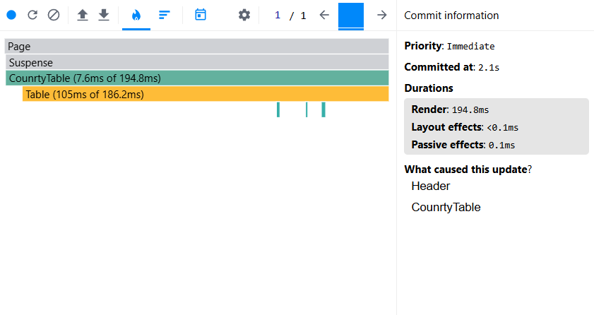

#### Ranked Chart for sorting
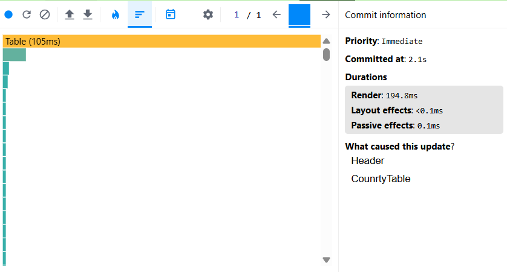

  ### - Searching for a country:

  - **Commit Duration: 2.5s**
  - **Render Duration: 108.2ms**
  - **Interactions:** Not recorded (Profiler did not capture explicit interactions, but commit and render times were analyzed instead)

### - Screenshots:

#### Flame Graph for search
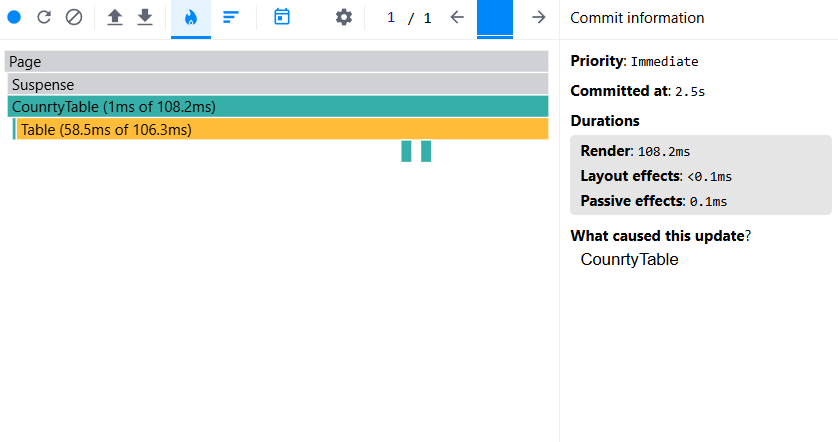

#### Ranked Chart for search
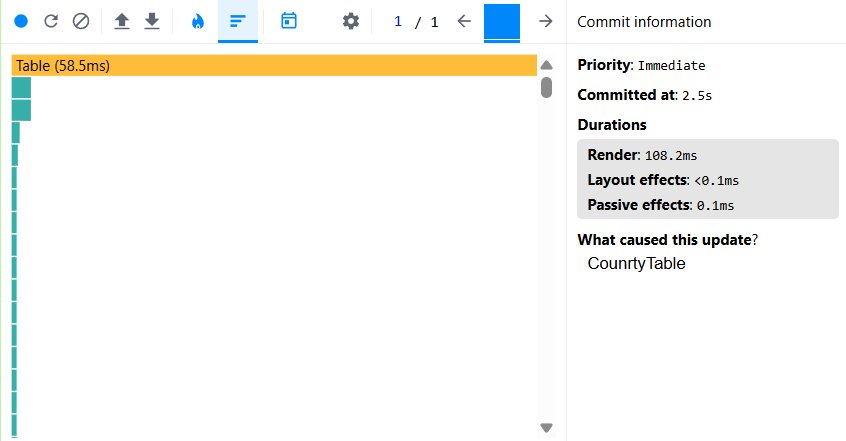

  ### - Selecting a year:

  - **Commit Duration: 3.2s**
  - **Render Duration: 107.4ms**
  - **Interactions:** Not recorded (Profiler did not capture explicit interactions, but commit and render times were analyzed instead)

### - Screenshots:

#### Flame Graph for year
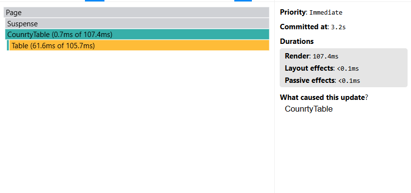

#### Ranked Chart for year
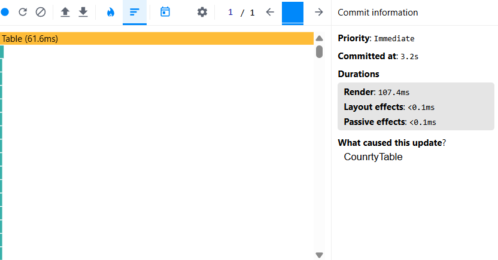

  ### - Adding/removing columns:

  - **Commit Duration: 1s**
  - **Render Duration: 51.2ms**
  - **Interactions:** Not recorded (Profiler did not capture explicit interactions, but commit and render times were analyzed instead)

### - Screenshots:

#### Flame Graph for columns
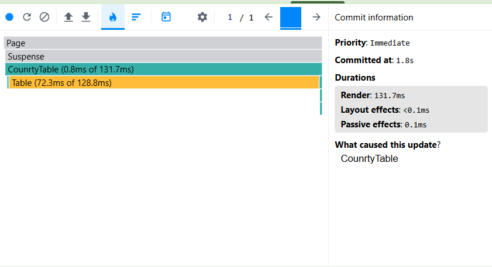

#### Ranked Chart for columns
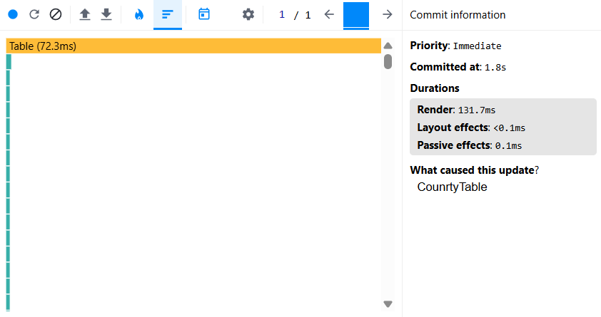

 ## After optimization

  ### - Sorting a column:

  - **Commit Duration: 2.4s**
  - **Render Duration: 114.2ms**
  - **Interactions:** Not recorded (Profiler did not capture explicit interactions, but commit and render times were analyzed instead)

### - Screenshots:

#### Flame Graph for sorting
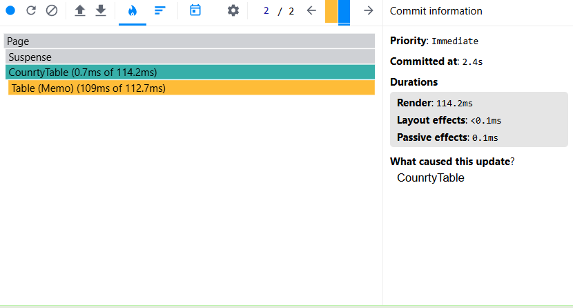

#### Ranked Chart for sorting
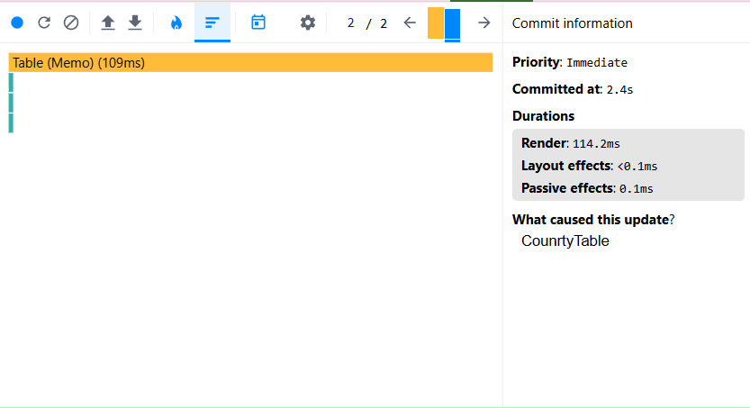

  ### - Searching for a country:

  - **Commit Duration: 2.2s**
  - **Render Duration: 76.4ms**
  - **Interactions:** Not recorded (Profiler did not capture explicit interactions, but commit and render times were analyzed instead)

### - Screenshots:

#### Flame Graph for search
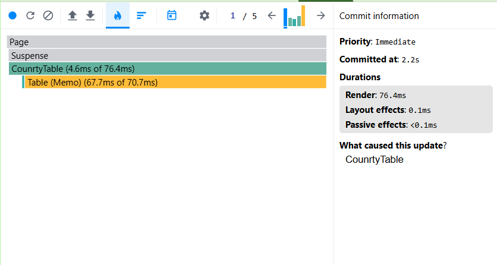

#### Ranked Chart for search
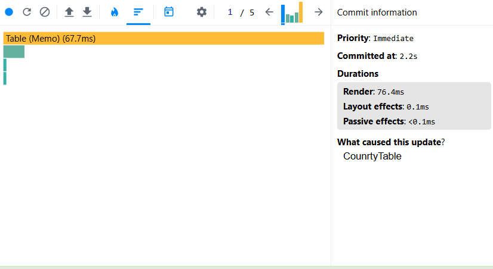

  ### - Selecting a year:

  - **Commit Duration: 2.8s**
  - **Render Duration: 214.1ms**
  - **Interactions:** Not recorded (Profiler did not capture explicit interactions, but commit and render times were analyzed instead)

### - Screenshots:

#### Flame Graph for year
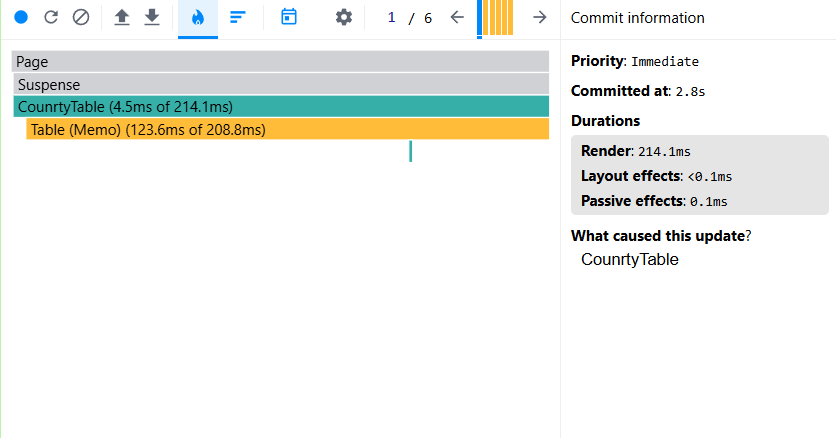

#### Ranked Chart for year
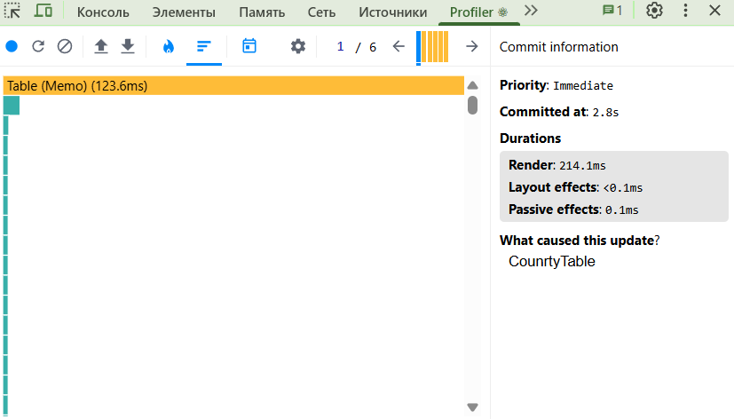

  ### - Adding/removing columns:

  - **Commit Duration: 0.9s**
  - **Render Duration: 13.3ms**
  - **Interactions:** Not recorded (Profiler did not capture explicit interactions, but commit and render times were analyzed instead)

### - Screenshots:

#### Flame Graph for columns
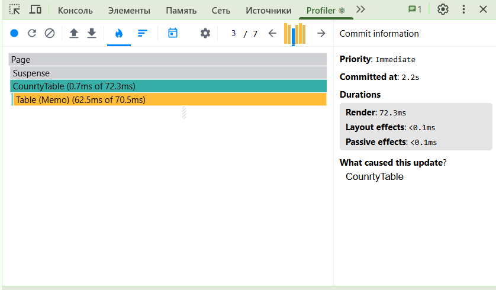

#### Ranked Chart for columns
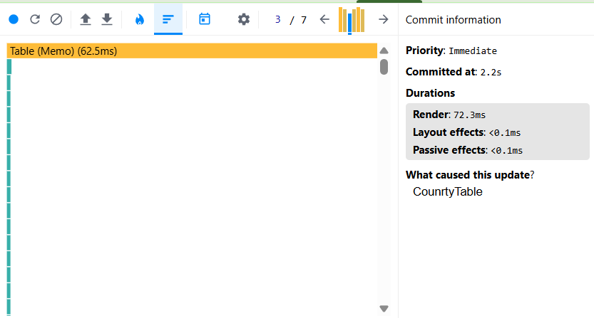

---

> As you can see, memoization mainly helped to improve sorting by year and country name. If I have time, I will definitely use an additional strategy and improve the rendering result.